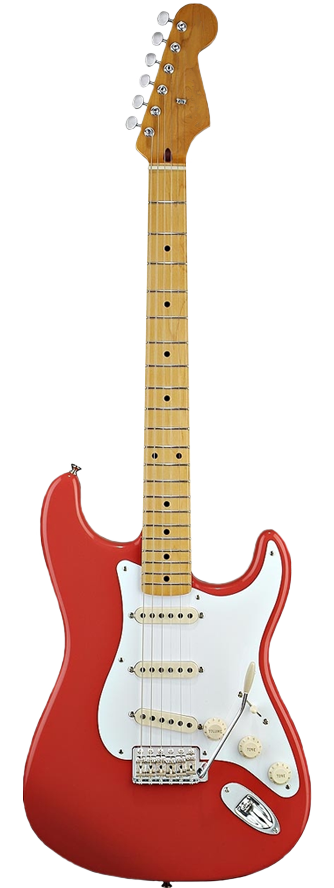

# AWA1 - Projet

## Description
Dans le cadre du cours AWA1, j'ai réaliser un slider de produits comprenant des animations réaliser avec [Dynamics.js](http://dynamicsjs.com/).

## Rendu final
Il est possible de parcourir les produits grâce aux flèches de navigations et de cliquer sur un bouton pour avoir un affichage plus détailler du produit.

> Affichage sous forme de gif, s'il ne marche correctement veuillez le consuler sur [Github](https://github.com/AntoineDessauges/AWA1) ou avec le [lien directe](https://i.imgur.com/rakhMtX.gif) vers le fichier.

## Inspiration
Afin de trouver une idée d'animation, je me suis rendu sur le site de [Codrops](https://tympanus.net/codrops/) et j'ai choisi le projet [Elastic Circle Slideshow](https://tympanus.net/codrops/2016/01/27/elastic-circle-slideshow/) comme source d'inspiration.

> Affichage sous forme de gif, s'il ne marche correctement veuillez le consuler sur [Github](https://github.com/AntoineDessauges/AWA1) ou avec le [lien directe](https://tympanus.net/Development/ElasticCircleSlideshow/) vers la demo de Codrops.

## Déploiement
Afin de déployer le projet, télécharger le depuis le [Github](https://github.com/AntoineDessauges/AWA1) ou en le  clonant le avec git grâce à la commande suivante ( en vous plaçant dans le dossier ou vous voulez cloner le projet) : `git clone https://github.com/AntoineDessauges/AWA1.git`.

Il vous suffit d’exécuter le fichier `index.hmtl` avec votre navigateur, aucun environnement particulier n'es nécessaire.

## Fonctionnement
Ce slider à été réaliser avec les outils et technologies suivantes :
 
 - Html / Css
 - [JavaScript](https://www.javascript.com/)
 - [Dynamics.js](http://dynamicsjs.com/)
 - [jQuery](https://jquery.com/)
 - [Font awesome](http://fontawesome.io/icons/)
 - [Google Fonts](https://fonts.google.com/)

Le code est séparer en trois fichier :

 - index.html
 - main.js
 - main.css

### main.css
Contient le style du slider.

### main.js
Contient tous le code Javascript ainsi que les animations

### index.html
Contient le code html affichant la page.
C'est à cette endroit que l'on défini le contenu des slides et que l'on peut en rajouter ou en supprimer. Pour cela il faut respecter la strucutre défini pour le slider :

    

        

            

                <i class="up fa fa-long-arrow-up" aria-hidden="true"></i>
                <i class="down fa fa-long-arrow-down" aria-hidden="true"></i>
            

            <button class="buy">Acheter</button>
            

                
                349$
                <h2 class="name">Guitare 1</h2>
                
Description guitare 1

            

            

                
                1099$
                <h2 class="name">Guitare 2</h2>
                
Description guitare 2

            

            

            // insérer une ou plusieurs slides ici si désirer 
    
